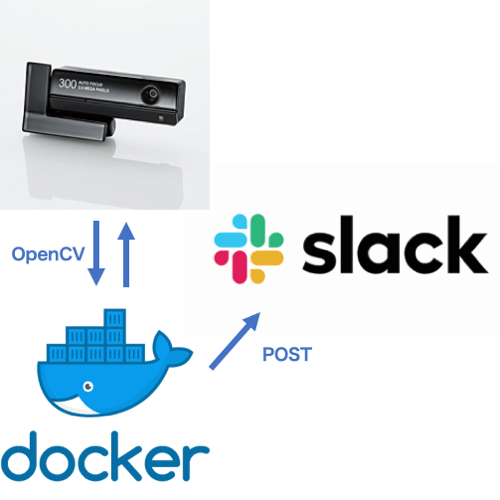

# slack_webcam_bot [](https://hub.docker.com/r/okwrtdsh/slack_webcam_bot/)



## How to Use
### 1. clone [this repository](https://github.com/okwrtdsh/slack_webcam_bot.git)

```
$ git clone https://github.com/okwrtdsh/slack_webcam_bot.git
```

### 2. get slack api token and slack channel id
* slack api token

https://get.slack.help/hc/en-us/articles/215770388-Create-and-regenerate-API-tokens

* slack channel id

https://www.wikihow.com/Find-a-Channel-ID-on-Slack-on-PC-or-Mac

### 3. check your camera devices
* I use [this webcam (Elecom UCAM-DLY300TA)](https://www2.elecom.co.jp/multimedia/pc-camera/ucam-dly300ta/)

```
$ v4l2-ctl --list-devices
UCAM-DLY300TA (usb-0000:00:14.0-3):
	/dev/video0
```

### 4. modify docker-compose.yml

* set `TOKEN` to your slack api token
* set `CHANNEL` to your slack channel id
* mount the camera device to `/dev/video0`

`docker-compose.yml`

```yaml
    devices:
      - YourCameraDevice:/dev/video0
    environment:
      - TOKEN=YourToken
      - CHANNEL=YourChannelId
```

### 5. run with docker-compose

```
$ docker-compose up -d
```
